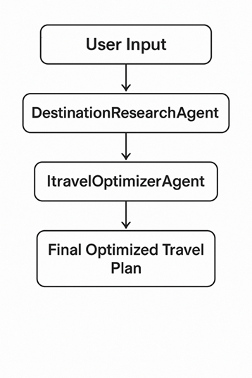
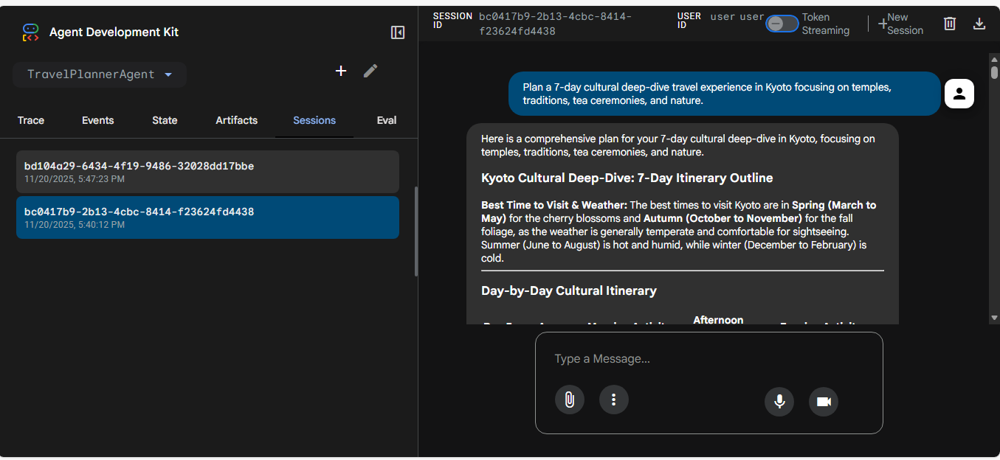
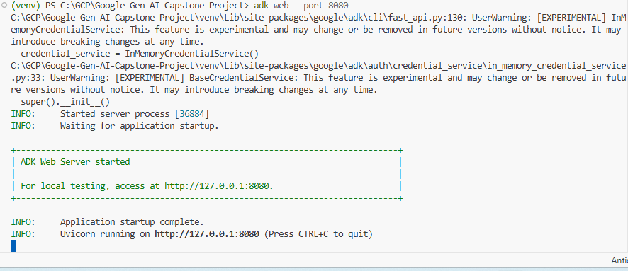
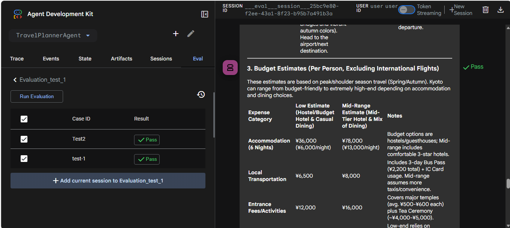

# JourneyWeaver AI Agent - Technical Documentation


## 1. Introduction

**JourneyWeaver** is an advanced AI-powered travel planning system built using the Google Gen AI Agent Development Kit (ADK). It employs a sequential multi-agent architecture to research destinations, build detailed itineraries, and optimize travel plans with practical advice.

## 2. System Architecture

The system utilizes a **Sequential Agent** pattern, where the output of one agent serves as the context/input for the next.

### High-Level Diagram



### Agent Flow

1. **DestinationResearchAgent**:
   - **Role**: Researcher.
   - **Input**: User's destination and travel preferences.
   - **Tools**: Google Search.
   - **Output**: Comprehensive research on weather, attractions, culture, and safety (`destination_research`).

2. **ItineraryBuilderAgent**:
   - **Role**: Planner.
   - **Input**: `destination_research` data.
   - **Output**: Structured day-by-day itinerary with budget estimates (`travel_itinerary`).

3. **TravelOptimizerAgent**:
   - **Role**: Consultant.
   - **Input**: `travel_itinerary`.
   - **Output**: Final optimized plan with money-saving tips, packing lists, and contingency plans.

### Execution Flows

**Invocation Flow:**


**Sequential Agent Execution:**
.png)

## 3. Prerequisites

- **Python**: 3.9 or higher.
- **Google Cloud Project**: With Vertex AI API enabled.
- **API Keys**: Google Gen AI API Key.

## 4. Installation & Setup

1. **Clone the Repository**:
   ```bash
   git clone <repository-url>
   cd TravelPlannerAgent
   ```

2. **Create Virtual Environment**:
   ```bash
   python -m venv venv
   source venv/bin/activate  # On Windows: venv\Scripts\activate
   ```

3. **Install Dependencies**:
   ```bash
   pip install -r requirements.txt
   ```

4. **Environment Configuration**:
   Create a `.env` file in the root directory:
   ```env
   GOOGLE_API_KEY=your_google_api_key_here
   PROJECT_ID=your_gcp_project_id
   LOCATION=us-central1
   ```

## 5. Usage

The agent is initialized in `agent.py`. You can run it directly or integrate it into a larger application via the `Runner`.

### Running the Agent

usinf adk web command in console , agent will run in web console and you can test it there in adk web ui with local url http:127.0.0.1:8080
here the web UI 


## 6. Code Structure

- **`agent.py`**: Main entry point.
  - **`logging`**: Configures debug logging.
  - **`retry_config`**: Defines HTTP retry logic for robustness.
  - **`AGENT_MODEL`**: Configures the Gemini model (currently `gemini-2.5-flash-lite-preview-09-2025`).
  - **`session_service`**: Manages conversation state (currently `InMemorySessionService`).
  - **Agents**: Definitions for `DestinationResearchAgent`, `ItineraryBuilderAgent`, and `TravelOptimizerAgent`.
  - **`root_agent`**: The `SequentialAgent` orchestrating the workflow.
  - **`runner`**: The ADK runner instance.

## 7. Deployment Guide (Google Cloud Run)

To deploy this agent as a scalable microservice:

### 1. Containerize

Create a `Dockerfile` in the root:

```dockerfile
FROM python:3.9-slim

WORKDIR /app
COPY . .
RUN pip install --no-cache-dir -r requirements.txt

# Assuming you wrap the runner in a web server (e.g., FastAPI)
# CMD ["uvicorn", "main:app", "--host", "0.0.0.0", "--port", "8080"]
```

### 2. Build & Push

```bash
gcloud builds submit --tag gcr.io/YOUR_PROJECT_ID/travel-planner-agent
```

### 3. Deploy to Cloud Run

```bash
gcloud run deploy travel-planner-agent \
  --image gcr.io/YOUR_PROJECT_ID/travel-planner-agent \
  --platform managed \
  --region us-central1 \
  --allow-unauthenticated
```

## 8. Scalability Strategy

The current implementation uses `InMemorySessionService`, which is suitable for single-instance deployments. For high scalability:

1. **Statelessness**: Move session state out of memory.
2. **Distributed Session Store**: Replace `InMemorySessionService` with a persistent store like **Firestore** or **Redis**. This allows any instance to handle any user request.
   ```python
   # Example conceptual change
   from google.adk.sessions import FirestoreSessionService
   session_service = FirestoreSessionService(project_id="...")
   ```
3. **Horizontal Scaling**: Cloud Run automatically scales the number of container instances based on request traffic (CPU/Memory utilization).
4. **Caching**: Implement caching for `DestinationResearchAgent` results (e.g., using Redis) to reduce API costs and latency for popular destinations.

## 9. Troubleshooting

| Issue                      | Possible Cause       | Solution                                                                                                  |
| -------------------------- | -------------------- | --------------------------------------------------------------------------------------------------------- |
| **429 Too Many Requests**  | API quota exceeded.  | The `retry_config` handles transient errors, but you may need to request a quota increase.                |
| **Context Limit Exceeded** | Itinerary too long.  | Reduce the scope of the request or switch to a model with a larger context window (e.g., Gemini 1.5 Pro). |
| **Empty Response**         | Search tool failure. | Verify internet connectivity and Google Search tool configuration.                                        |

## 10. FAQ

**Q: Can I add more agents?**
A: Yes, simply define a new `Agent` in `agent.py` and add it to the `sub_agents` list in the `root_agent` definition.

**Q: How do I change the AI model?**
A: Update the `model` parameter in the `AGENT_MODEL` initialization in `agent.py`.

**Q: Does it support other languages?**
A: Yes, Gemini is multilingual. You can prompt the agent in other languages, or add a system instruction to always output in a specific language.

**Q: Is the data persisted?**
A: Currently, no. The `InMemorySessionService` is volatile. See the **Scalability** section for persistence options.

## 11. Visuals & Screenshots

### ADK Web Console

The agent can be monitored and tested using the ADK Web Console:


### Evaluation Results

Performance metrics and evaluation results:

